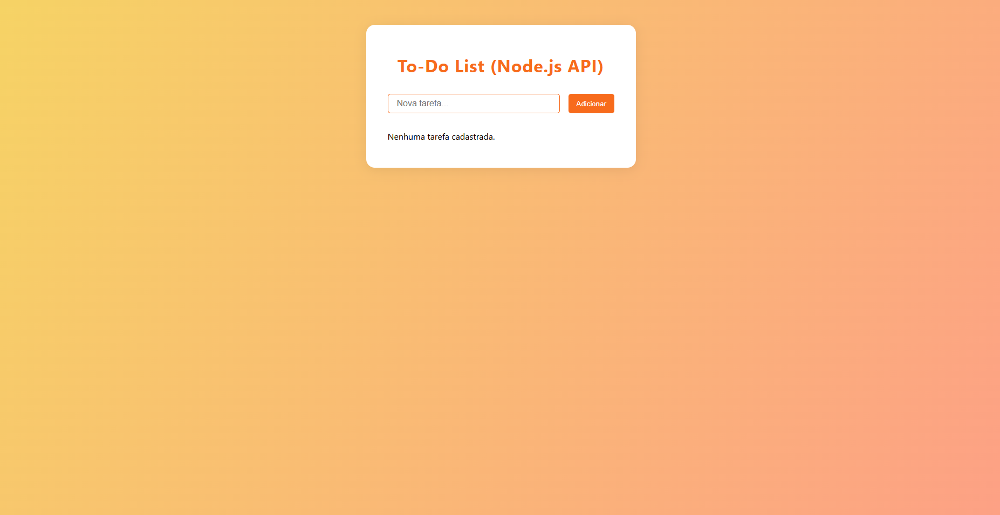

# To-Do List API + Frontend com Node.js Puro

Este projeto é uma aplicação completa de lista de tarefas (To-Do List) usando **Node.js puro** (sem frameworks) para a API e um frontend simples em HTML/CSS/JS, ideal para estudos, portfólio e demonstração no GitHub.

## Funcionalidades
- **API RESTful** para gerenciar tarefas
  - Listar tarefas: `GET /tasks`
  - Adicionar tarefa: `POST /tasks` (body: `{ "title": "Minha tarefa" }`)
  - Marcar tarefa como concluída: `PUT /tasks/:id`
  - Remover tarefa: `DELETE /tasks/:id`
- **Frontend integrado** (acessível em `/`)
  - Visual moderno e responsivo
  - Adicionar, concluir e remover tarefas pela interface
- **Persistência em arquivo** (`tasks.json`)
- **Sem dependências externas**

## Estrutura do Projeto
```
Node/
├── server.js      # Servidor Node.js puro (API + frontend)
├── index.html     # Frontend da aplicação
├── style.css      # Estilos do frontend
├── tasks.json     # Banco de dados simples (JSON)
├── screenshot.png # Print do frontend
└── README.md      # Este arquivo
```

## Como rodar
1. **Pré-requisito:** Node.js instalado (v14+ recomendado)
2. Clone este repositório ou copie os arquivos para uma pasta
3. No terminal, execute:
   ```bash
   node server.js
   ```
4. Acesse [http://localhost:3000](http://localhost:3000) no navegador

## Exemplos de uso da API
### Listar tarefas
```bash
curl http://localhost:3000/tasks
```
### Adicionar tarefa
```bash
curl -X POST -H "Content-Type: application/json" -d '{"title":"Estudar Node.js"}' http://localhost:3000/tasks
```
### Marcar tarefa como concluída
```bash
curl -X PUT http://localhost:3000/tasks/ID_DA_TAREFA
```
### Remover tarefa
```bash
curl -X DELETE http://localhost:3000/tasks/ID_DA_TAREFA
```

## Print do frontend


## Licença
MIT

---

Feito para fins de estudo e demonstração de Node.js puro, API RESTful e integração frontend simples. 